# Bitácora de Evidencias — Taller Práctico #1 (Pepito Plus)

> Instrucciones de uso: por cada avance, agrega una entrada nueva con el
> formato de abajo. No borres entradas viejas — esto se convierte en tu
> anexo de evidencias para el documento final y para la sustentación.

**Formato de cada entrada:**
```
### [Fecha] — [Nombre corto del avance]
**Sustenta:** RF#, o Entregable (Modelo de datos / Arquitectura / Infraestructura)
**Captura:** [nombre_archivo.png o "ver figura X"]
**Dónde se tomó:** [URL / herramienta / comando exacto]
**Qué demuestra:** [1-2 frases]
```

---

## 1. Configuración del entorno de desarrollo

### Estructura del proyecto y entorno virtual
**Sustenta:** Base para todos los RF (no es un requisito puntual, pero es prerrequisito)
**Captura:** `01_estructura_carpetas.png`
**Dónde se tomó:** VS Code, panel Explorer
**Qué demuestra:** Separación de responsabilidades por capas: rutas web, modelos de datos, lógica de crawling, y servicios de análisis (matching, identidad, clasificación) están en módulos independientes.

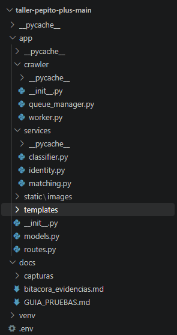

---

**Captura:** `02_requirements_venv.png`
**Dónde se tomó:** Explorador de Windows, carpeta `taller-pepito-plus`
**Qué demuestra:** El entorno Python está aislado con sus dependencias (`flask`, `sqlalchemy`, `pymysql`, `requests`, `beautifulsoup4`) registradas en `requirements.txt`, permitiendo reproducibilidad.

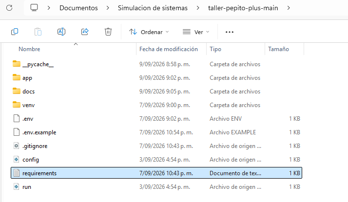

### Repositorio en GitHub
**Sustenta:** Requisito de entrega ("Entrega: Github")
**Captura:** `03_repo_github.png`
**Dónde se tomó:** GitHub, vista de repositorio `github.com/MafeGarciaC/taller-pepito-plus`
**Qué demuestra:** El código fuente está versionado y accesible; el `.gitignore` excluye correctamente `venv/` y `.env` para no exponer credenciales ni inflar el repositorio.

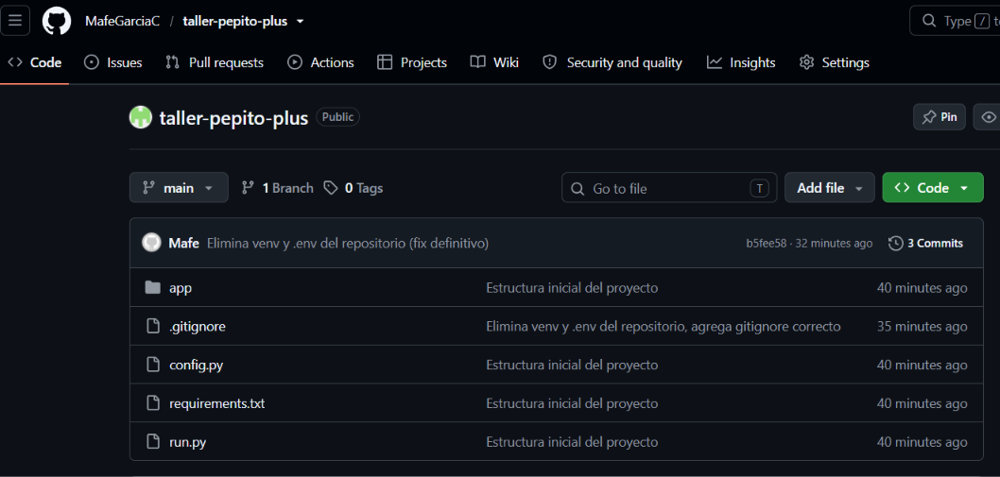

---

## 2. Modelo de datos (Entregable)

### Script de creación del esquema
**Sustenta:** Entregable "Modelo de datos"
**Captura:** (incluida en `schema.sql`, ver anexo de código)
**Dónde se tomó:** MySQL Workbench, `File > Open SQL Script`
**Qué demuestra:** Las 7 tablas (personas, fuentes, busquedas, urls, documentos, documento_analisis, metricas_concurrencia) y sus relaciones están formalmente definidas en SQL, con las restricciones de integridad (FK, UNIQUE, ENUM) que exige cada RF.

### Diagrama Entidad-Relación
**Sustenta:** Entregable "Modelo de datos"
**Captura:** `04_diagrama_er.png`
**Dónde se tomó:** MySQL Workbench, `Database > Reverse Engineer`
**Qué demuestra:** Las relaciones 1—N y 1—1 entre tablas reflejan el flujo de datos del sistema: una persona tiene múltiples búsquedas, cada búsqueda descubre URLs, cada URL puede generar un documento, y cada documento relacionado tiene un análisis de identidad/clasificación.

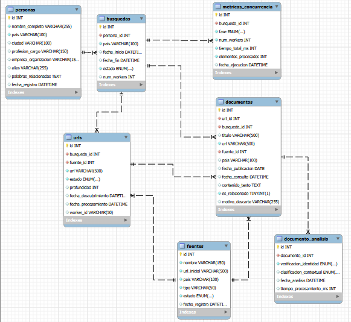

### Confirmación de la base de datos creada
**Sustenta:** Entregable "Modelo de datos"
**Captura:** `05_show_databases.png`
**Dónde se tomó:** MySQL Workbench, pestaña de query — comando `SHOW DATABASES;`
**Qué demuestra:** El esquema fue aplicado exitosamente sobre una instancia real de MySQL, no solo definido en papel.

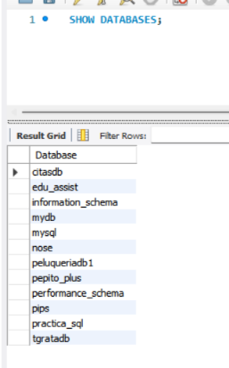

---

## 3. Conexión de la aplicación a la base de datos

### Modelos SQLAlchemy
**Sustenta:** Prerrequisito técnico para RF1, RF2, RF6, RF7, RF8, RF9
**Captura:** `06_models_py.png`
**Dónde se tomó:** VS Code, archivo `app/models.py`
**Qué demuestra:** Cada tabla del modelo de datos tiene su representación en código Python (ORM), lo que permitirá insertar/consultar datos desde Flask sin escribir SQL manual.

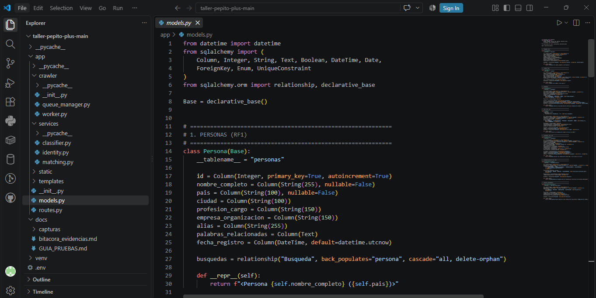

### Prueba de conexión extremo a extremo
**Sustenta:** Prerrequisito técnico transversal
**Captura:** `07_test_db_conexion.png`
**Dónde se tomó:** Navegador, `http://localhost:5000/test-db`
**Qué demuestra:** La cadena completa Flask → SQLAlchemy → MySQL funciona correctamente: la app puede levantar un servidor, conectarse a `pepito_plus`, y ejecutar una consulta real.

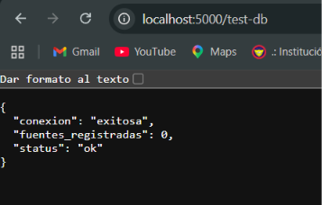

---

## 4. Pendientes (se llenan a medida que avancemos)

### RF1 — Registro de persona
**Sustenta:** RF1
**Captura:** `08_rf1_formulario.png`, `09_rf1_listado.png`
**Dónde se tomó:** Navegador, `http://localhost:5000/personas/nueva` y `http://localhost:5000/personas`
**Qué demuestra:** El sistema permite registrar una persona con nombre completo y país obligatorios (validados tanto en frontend con `required` como en backend), persiste los datos en MySQL vía SQLAlchemy, y los datos quedan disponibles para consulta posterior en `/personas`.

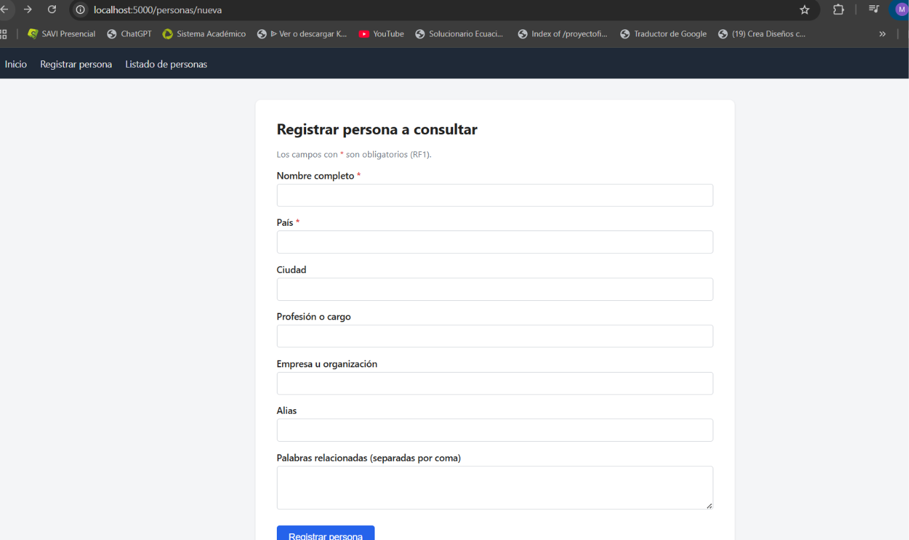
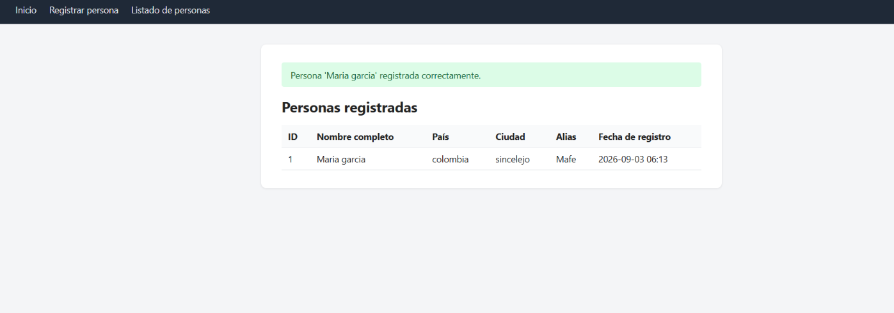

### RF2 — Administración de fuentes por país
**Sustenta:** RF2
**Captura:** `10_rf2_formulario.png`, `11_rf2_listado.png`
**Dónde se tomó:** Navegador, `http://localhost:5000/fuentes/nueva` y `http://localhost:5000/fuentes`
**Qué demuestra:** El sistema administra fuentes públicas con los 5 campos mínimos exigidos (nombre, URL inicial, país, tipo, estado), valida que todos sean obligatorios, y permite alternar el estado activa/inactiva desde el listado — funcionalidad clave para RF3, que solo debe crawlear fuentes activas.

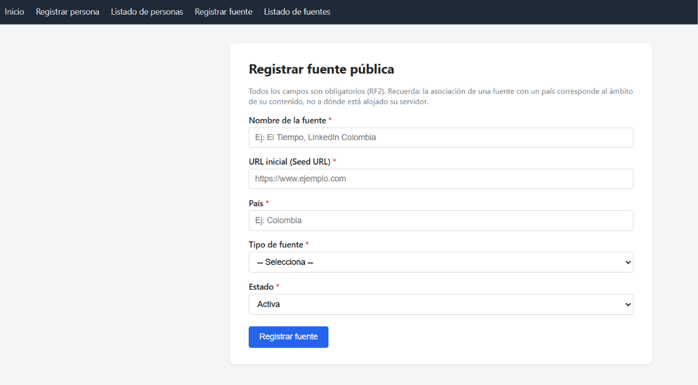
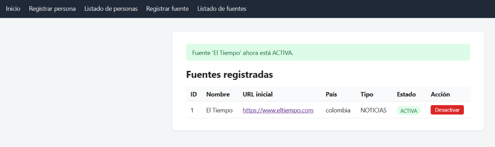

### RF3, RF4, RF5, RF6 — Crawler concurrente completo
**Sustenta:** RF3, RF4, RF5, RF6
**Captura:** `12_rf3_resultado_busqueda.png`, `13_rf4_estados_urls.png`
**Dónde se tomó:** Navegador, `http://localhost:5000/busquedas/1`; MySQL Workbench, `SELECT estado, COUNT(*) FROM urls GROUP BY estado`
**Qué demuestra:** El crawler procesó 50 URLs con 5 workers en 62.5 segundos, sin URLs bloqueadas en EN_PROCESAMIENTO (confirmando que el Lock evita el procesamiento duplicado exigido por RF4). Clasificó correctamente 1 documento relacionado y 25 descartados con su motivo (RF5), y el límite de exploración se respetó dejando URLs pendientes sin procesar por diseño (RF3).

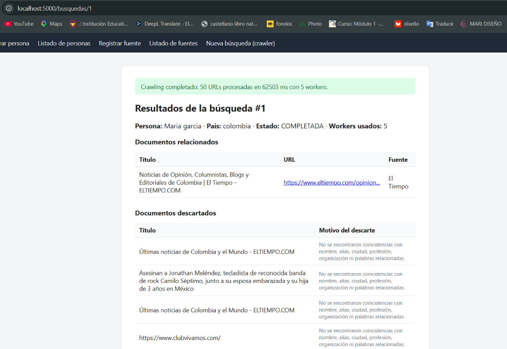
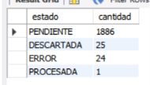

### RF7 — Verificación de identidad
**Sustenta:** RF7
**Captura:** _(pendiente — tabla `documento_analisis` con los 4 estados representados)_

### RF8 — Clasificación contextual
**Sustenta:** RF8
**Captura:** _(pendiente)_

### RF9 — Consulta y filtrado de resultados
**Sustenta:** RF9
**Captura:** _(pendiente — interfaz web con filtros aplicados)_

### Medición de concurrencia
**Sustenta:** Nota de medición de concurrencia (rúbrica)
**Captura:** _(pendiente — gráfica o tabla comparando tiempo con 1 worker vs. N workers)_

### Diagrama de arquitectura de software
**Sustenta:** Entregable
**Captura:** _(pendiente)_

### Diagrama de infraestructura
**Sustenta:** Entregable
**Captura:** _(pendiente)_
